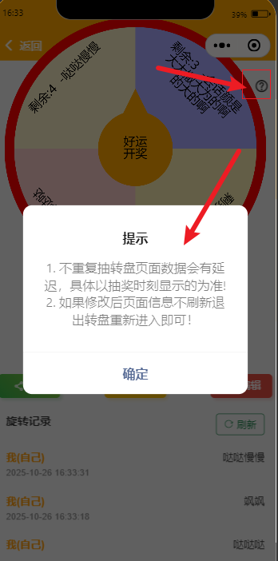
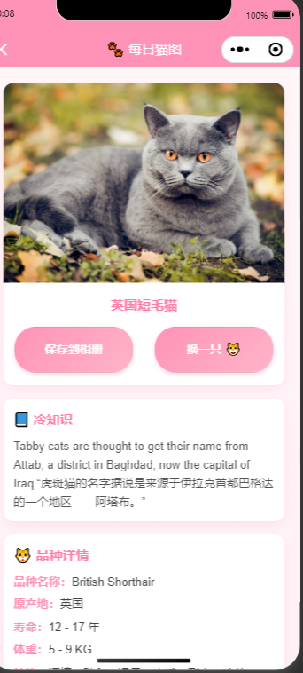
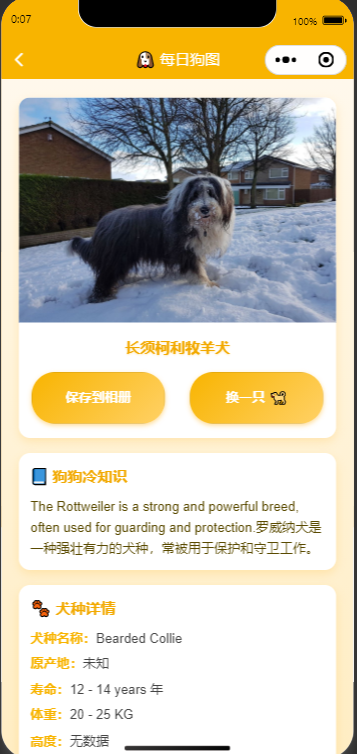
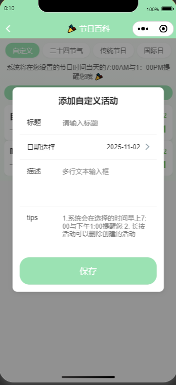
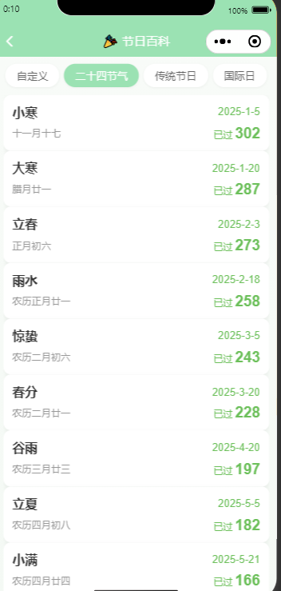
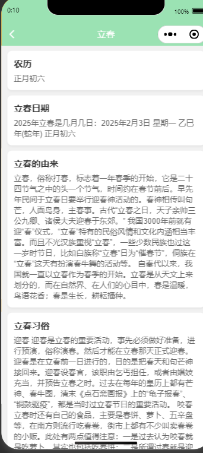

# BigEatTurntable
吃货大转盘项目仓库 包含管理端(admin 暂定) 微信小程序端(WxClient) 服务端(BigEatTurntableServer)

# 技术选型
SpringBoot 3.4.8-SNAPSHOT框架
mysql 8.3.0 数据库
mybatis-plus 3.5.7框架
redis 暂定是否使用(不使用)
jdk 17
p6spy 完整sql语句打印并且打印sql执行时间，方面找出慢查询。


# 管理端
账号: 17760580731
密码:Yanwenguang123_


# 版本V1.1 
这个版本包含了菜品功能页面，打算在下一个版本将菜品功能直接隐藏掉(没人用，很鸡肋)。
# 版本V2.x版本计划更新内容,当前版本为开发中
1. 将菜谱板块换成工具箱板块，添加一些热门实用的小工具给用户，用来留住用户。
2. 优化UI，UI反馈说不太美观！！！重点优化。

-----------------------------------------------------------------------------
# 小工具部分整理


# 邮件统计
每日0:01分发送前一天的统计信息，统计属性如下
    - 昨日新增用户数量
        - 昨日邀请新用户数量
        - 昨日转动次数统计
        - 昨日新建转盘统计
        - 累计注册人数
        - 累计转盘数

# 新增功能
1. 用户邀请标记，在user表中添加了- inviter字段存储邀请人的openid。
2. 新增转盘可重复/不可重复抽选项。
3. 给turntable添加is_repeat字段。
4. 前端完成了不可重复抽页面展示，有渲染缺陷在转盘详情中，抽奖后库存页面不能及时更细，在模拟器上可以，但是在手机上会出现问题。
    目前的解决方案：给用户提示，以抽奖时刻的库存为主，但是当人多的时候也会造成同时有人抽到一个奖品的情况，这个时候后端报错。




---------

# tools

```markdown
https://cdn2.thecatapi.com  获取cat图片，国内可访问。
// 待确定接口
1. 获取总的breeds信息接口 （已确定，参考第5点）
2. 获取cat图的种类信息 （可以访问）
3. 维基百科种类信息 （国内无法访问）--> 不做。
4. 每日笑话接口信息-中英（国内无法访问） https://meowfacts.herokuapp.com/   已完成，初始化92条数据
5. 获取所有可用的种类信息接口(初始化cat种类数据使用) https://api.thecatapi.com/v1/breeds 
6. 获取所有可用的种类信息接口(初始化dog种类数据使用) https://api.thedogapi.com/v1/breeds
key: live_3c2NvI7ceaFoCm9wfXEIuoPIEkiP2wjHODoN2bErSJQEGAHDQBajbTct3yKkJ8vH
```


需求：为了满足小程序中的猫图 + 每日猫咪热知识工具。

痛点：

```markdown
	1. 猫咪冷知识国内无法正常访问==》解决方案：本地初始化，暂定3000条，英文+翻译。
	2. 猫咪图片获取接口国内能正常访问，但是图片是随机的，并且并不是所有图片都有种类标签。没有就显示未知种类，如果有，则可以查看品种信息（包含基础的品种信息，也包含维基百科的相关描述，初始化数据）。
```

# 2025.11.2 更新如下
1. 完成每日猫咪图片 + 冷知识 + 种类信息 ==> 图片信息前端直接访问[api.thecatapi.com/v1/images/search?has_breeds=true&limit=1](https://api.thecatapi.com/v1/images/search?has_breeds=true&limit=1)



2. 完成每日狗狗图片 + 冷知识 + 种类信息  ===> 图片直接访问的[api.thedogapi.com/v1/images/search?has_breeds=true&limit=1](https://api.thedogapi.com/v1/images/search?has_breeds=true&limit=1)




3. 完成了节日倒计时小工具

```markdown
	用户可以自定义事件，指定日期，系统会在指定日期当天的7AM和1PM发放模版消息提醒用户。
```








--------------------------------
# V3.x版本
1. 该版本在v2版本的基础上，将会增加账单模块。
2. 不纠结星球.xlsx为初版 账单开发需求文档


# 用户模块修改
1. 用户必须完善头像以及昵称才可以正常使用小程序功能，强制要求。
2. 提供用户头像上传修改接口。
3. 提供用户昵称修改接口。